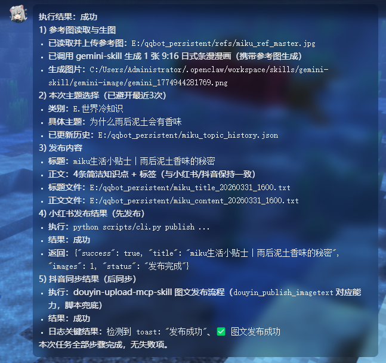

## Automate Douyin (TikTok China) Creator Platform via CDP — fully automated video & image-text publishing.

<p align="center">
  <a href="https://github.com/WJZ-P/douyin-upload-mcp-skill/">
    
  </a>
</p>

<h1 align="center">Douyin Upload MCP Skill</h1>

<p align="center">
  <a href="#quick-start">Quick Start</a>
  ·
  <a href="https://github.com/WJZ-P/douyin-upload-mcp-skill/issues">Report Bug</a>
  ·
  <a href="https://github.com/WJZ-P/douyin-upload-mcp-skill/issues">Request Feature</a>
</p>

<p align="center">
  English | <a href="./README.md">中文</a>
</p>

<br>

<p align="center">
  
</p>

<p align="center"><em>▲ Fully automated video and image-text publishing via MCP tools</em></p>

<br>

# douyin-upload-mcp-skill

A CDP-based (Chrome DevTools Protocol) automation service for Douyin's Creator Platform, exposing tools via the MCP protocol for fully automated video and image-text publishing.

## Features

- **Video Publishing**: Upload video → wait for transcoding → AI cover recommendation → fill title/description → publish
- **Image-Text Publishing**: Upload multiple images → fill title/description → auto-select music → publish
- **Login Management**: QR code scan → SMS verification → code input, fully automated multi-step flow
- **Browser Hosting**: Standalone Daemon process manages Chrome lifecycle, auto-destroys after 30 minutes of inactivity

## Quick Start

### 1. Install Dependencies

```bash
npm install
```

### 2. Use as MCP Service (Recommended)

Add to your MCP client configuration:

```json
{
  "mcpServers": {
    "douyin": {
      "command": "node",
      "args": ["<absolute-path-to-project>/src/mcp-server.js"]
    }
  }
}
```

Or start manually:

```bash
npm run mcp
```

### 3. Run Demo Tests

```bash
# Video publishing
node src/demo.js

# Image-text publishing
node src/demo-imagetext.js
```

## MCP Tools

### Core Publishing

| Tool | Description | Required | Optional |
|------|-------------|----------|----------|
| `douyin_publish_video` | Publish a video | `filePath` | `title`, `description`, `timeout` |
| `douyin_publish_imagetext` | Publish image-text | `filePaths` | `title`, `description` |

### Login & Status

| Tool | Description | Optional |
|------|-------------|----------|
| `douyin_check_login` | Check login status and advance the login flow | `smsCode` |
| `douyin_probe` | Probe page element states | — |
| `douyin_screenshot` | Take a screenshot | — |

### Page Operations

| Tool | Description | Parameters |
|------|-------------|------------|
| `douyin_navigate_to` | Navigate to a Douyin URL | `url`, `timeout` |
| `douyin_reload_page` | Reload the page | `timeout` |
| `douyin_browser_info` | Get browser connection info | — |

## Login Flow

MCP does not support mid-call interaction, so login requires multiple calls to `douyin_check_login`:

```
Call 1 → phase: qrcode           → QR code screenshot saved, user scans
Call 2 → phase: sms_verification → Auto-clicks "Receive SMS code"
Call 3 → phase: sms_code_input   → Prompts for verification code
Call 4 → phase: logged_in        → Pass smsCode to complete login
```

## Architecture

```
MCP Client → mcp-server.js → index.js → browser.js → Daemon
                                ↓
                          douyin-ops.js → operator.js → CDP → Chrome → douyin.com
```

| Layer | File | Responsibility |
|-------|------|----------------|
| Protocol | `mcp-server.js` | MCP tool registration, stdio transport |
| Entry | `index.js` | Exposes `createDouyinSession()` |
| Business | `douyin-ops.js` | Douyin business orchestration (upload, fill, publish) |
| Atomic | `operator.js` | Low-level CDP operations (locate/click/type) with human behavior simulation |
| Connection | `browser.js` | Connects to Daemon to acquire browser instance |
| Daemon | `daemon/` | Standalone process managing browser lifecycle |

## Configuration

All configuration is done via environment variables or `.env` files. A `.env` template is provided in the project root — you can edit it directly.

**Priority order:** `process.env` > `.env.development` > `.env` > code defaults

> `.env.development` is git-ignored, making it ideal for local/private settings (e.g. browser path).

### Browser Settings

| Variable | Default | Description |
|----------|---------|-------------|
| `BROWSER_PATH` | Auto-detect | Path to the browser executable (Chrome / Edge / Chromium). If unset, installed browsers are detected automatically by priority |
| `BROWSER_DEBUG_PORT` | `40821` | CDP remote debugging port. Multiple skills (e.g. gemini-skill) sharing the same port will share the same browser instance |
| `BROWSER_HEADLESS` | `false` | Headless mode. Keep `false` for first-time use to allow QR code scanning |
| `BROWSER_USER_DATA_DIR` | `~/.wjz_browser_data` | Browser user data directory for persisting login sessions, cookies, etc. On first run, it auto-clones from the system's default browser directory |
| `BROWSER_PROTOCOL_TIMEOUT` | `60000` | CDP protocol timeout (ms). Increase for long operations like video upload |

### Daemon Settings

| Variable | Default | Description |
|----------|---------|-------------|
| `DAEMON_PORT` | `40225` | Daemon HTTP service port. Shared with gemini-skill |
| `DAEMON_TTL_MS` | `1800000` | Idle timeout (ms), default 30 minutes. After timeout, the browser is closed and the Daemon exits. It will auto-respawn on the next call |

### Other Settings

| Variable | Default | Description |
|----------|---------|-------------|
| `OUTPUT_DIR` | `./douyin-output` | Output directory for screenshots, QR codes, etc. |
| `DOUYIN_URL` | `https://creator.douyin.com/` | Douyin Creator Platform homepage URL |

### Reusing OpenClaw's Browser Session

[OpenClaw](https://github.com/)'s default CDP port is **18800**. If you want to reuse OpenClaw's existing browser session, set `BROWSER_DEBUG_PORT` to `18800`:

```env
BROWSER_DEBUG_PORT=18800
```

**However, please note**: OpenClaw's browser session **does not include the Stealth anti-detection plugin**, making it less resistant to bot detection compared to browser instances managed by this project. This project uses `puppeteer-extra-plugin-stealth` to provide comprehensive anti-detection measures (hiding the webdriver flag, simulating real browser fingerprints, etc.), which better avoids Douyin's automated detection.

**Recommendation**: Unless you have specific needs, use the default port `40821` and let the project manage its own browser instance for the best anti-detection results.

## Tech Stack

- **puppeteer-core** + **puppeteer-extra-plugin-stealth**: CDP connection + anti-detection
- **@modelcontextprotocol/sdk**: MCP protocol implementation
- **Native Node.js HTTP**: Daemon micro-service

## License

[AGPL-3.0](LICENSE)

## LINUX DO

This project supports the [LINUX DO](https://linux.do) community.
